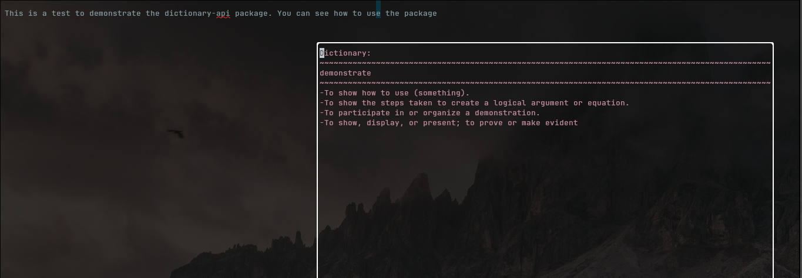

# Dictionary-Api
Dictionary API call CLI tool for handling text files in NeoVim. Built in
TypeScript using the [Bun](https://bun.sh) runtime

```bash
### install bun if you haven't already
curl -fsSL https://bun.sh/install | sh
```
This project is easily built with bun.
```bash
bun init

## bun will add the necessary node modules

## It will populate the directory with a index.ts file, you can remove it with the following command
rm index.ts
```

To compile and run the project:
```bash
bun run compile
```

To attach it to NeoVim, move it to a directory you won't delete. And add the
following to your NeoVim config:
# dictDefSyn.lua
```lua

local function makeCall(opt, wd)
	local cmd = '~/.config/nvim/after/plugin/txtfiles/dict-api --'..opt..' "'..wd..'"'
	local handle = io.popen(cmd)
	if handle == nil then
		return error("error in making call")
	end
	local result = handle:read("*a")
	if result == nil then
		print("error in call")
		return 
	end
	handle:close()
	return result --returns a string '{word = <wd>, definition = <definition>}'
end

function GetDefOrSyn(opt)
	if opt ~= 'def' and opt ~= 'syn' then
		return error("opt must be 'def' or 'syn', you passed "..opt)	
	end
	local title = (opt == 'def') and 'Dictionary:' or 'Thesaurus:'
	vim.cmd('normal! gv"xy')
	local wd = vim.fn.getreg('x')
	wd = string.gsub(wd, '\n',"") --strip whitespace
	local wdObjStr = makeCall(opt, wd) --returns string
	local tblFunc = load("return " .. wdObjStr)
	if tblFunc == nil then
		print("error in building table")
		return
	end
	local wdObj = tblFunc()
	CreateFloatingWindow(wdObj, title)
end


```
This uses the Bun-built file (in this case, located in my
~/.config/nvim/after/plugin/txtfiles directory) and sends the visual selected 
word to the CLI. 

# dictUI.lua
From there, it's a matter of rendering the result in a floating window.
```lua
local function renderTitleSeparater(num)
	local sep = ''
	for i = 1, num, 1 do
		sep = sep .. '~'
	end
	return sep
end

local function newLineRender(obj)
	local definitions = obj.definitions
	local lines = {}
	for _, def in ipairs(definitions) do
		local new_string_def = "-"..def
		table.insert(lines, new_string_def)
	end
	return lines
end

function CreateFloatingWindow(wdObj,hdr)
	--get current buffer
	local bufnr = vim.api.nvim_create_buf(false,true)
	local winWidth = vim.api.nvim_win_get_width(0)
	local winHeight = vim.api.nvim_win_get_height(0)
	--calculate floating window size
	local floatWidth = math.ceil(winWidth * 0.4)
	local floatHeight = math.ceil(winWidth * 0.20)
	--calculate starting pos
	local col = math.ceil((winWidth-floatWidth)/2)
	local row = math.ceil((winHeight-floatHeight)/2)
	--set opts
	local opts = {
		relative='editor',
		width=floatWidth,
		height=floatHeight,
		col=col,
		row=row,
		style='minimal',
		border= {
		  {"╭", "FloatBorder"},
      {"─", "FloatBorder"},
      {"╮", "FloatBorder"},
      {"│", "FloatBorder"},
      {"╯", "FloatBorder"},
      {"─", "FloatBorder"},
      {"╰", "FloatBorder"},
      {"│", "FloatBorder"}
		},
	}
	vim.cmd("highlight FloatBorder guifg=white")
	--create the floating window
	local win = vim.api.nvim_open_win(bufnr, true, opts)
	--create separator
	local sep = renderTitleSeparater(floatWidth)
	--create body contents
	local body = newLineRender(wdObj)
	--set buffer contents
	vim.api.nvim_buf_set_lines(bufnr, 0, -1, false, {hdr, sep, wdObj.word, sep,
	unpack(body)})
	--set buffer keymap to close window with 'q'
	vim.api.nvim_buf_set_keymap(bufnr, 'n', 'q','<cmd>bd!<CR>', {noremap=true,
		silent=true
	})
end

```


## autocmds.lua
Finally, map the new functions to a filetype-triggered autocmd:
```lua
vim.api.nvim_create_autocmd('FileType', {
    pattern = {'txt','text','markdown','md'},
    callback = function ()
        vim.schedule(function ()
						vim.api.nvim_buf_set_keymap(0, "v", "<leader>df", [[:lua GetDefOrSyn('def')<CR>]], {noremap=true, silent=true})
						vim.api.nvim_buf_set_keymap(0, "v", "<leader>syn", [[:lua GetDefOrSyn('syn')<CR>]], {noremap=true, silent=true})
            vim.opt_local.spell = true
        end)
    end
})
```

The result looks like this:


